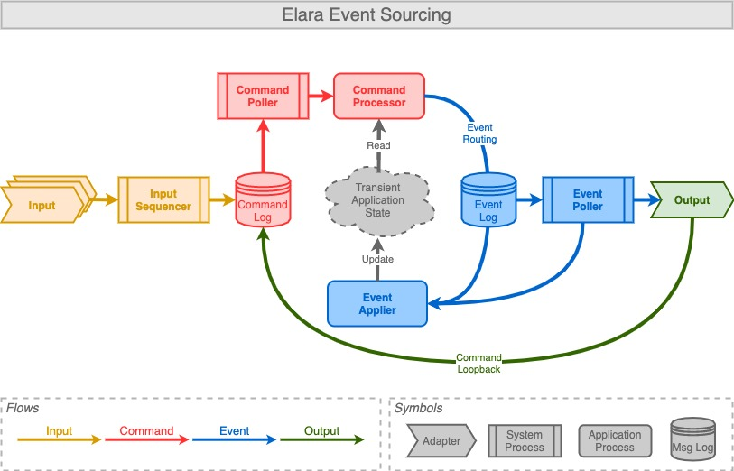

[](https://github.com/tools4j/elara/actions?query=workflow%3A%22Continuous+Integration%22)
[](https://search.maven.org/search?q=a:elara-*)
[](http://www.javadoc.io/doc/org.tools4j/elara-core)
## elara
The tools4j elara project provides an efficient, zero garbage framework to implement event sourcing applications.  

The event store is pluggable; a default implementation is available for [chronicle queue](https://github.com/OpenHFT/Chronicle-Queue).
  
Elara makes uses [direct buffers]() as defined by the [agrona](https://github.com/real-logic/agrona) library.  For this reason elara applications are perfectly suited to integrate with [SBE](https://github.com/real-logic/simple-binary-encoding) and [aeron](https://github.com/real-logic/aeron) UDP/IPC messaging.

The elara library is used productively in applications in the financial industry.  However elara is also under active development and some new plugins and features may be considered experimental especially if they are not released yet.

### Introduction 

#### Event Sourcing
There are excellent introduction to event sourcing.  Some of our favorite links are
* https://microservices.io/patterns/data/event-sourcing.html
* https://www.youtube.com/watch?v=fhZwzm-d9ys
* https://martinfowler.com/eaaDev/EventSourcing.html

#### Elara Event Sourcing


#### Terminology 
* **Command:** an input message; can be a state modifying command or a query
* **Event:** result of processing a command; instruction how to modify state or what output to generate
* **Command Log:** persisted log that stores sequentially all incoming commands
* **Event Log:** persisted event log that stores sequentially all routed events
* **Input:** a source of input commands, such as a message subscription
* **Output:** a publisher to communicate selected events to other applications
* **Command Processor:** handles command messages and has read-only access to application state; routes events
* **Event Applier:** triggered by events (routed or replayed); modifies the application state according to the event instruction

### Samples

#### Banking application
A simple banking app that supports the following commands:
* Creation of a bank account
* Money deposit, withdrawal and transfer

Sample code and test to run:
* [bank sample](https://github.com/tools4j/elara/tree/master/elara-samples/src/main/java/org/tools4j/elara/samples/bank)
* [bank test](https://github.com/tools4j/elara/blob/master/elara-samples/src/test/java/org/tools4j/elara/samples/bank/BankApplicationTest.java)

#### Timers
Timers are tricky with event sourcing.  Elara provides timers through the [timer plugin](https://github.com/tools4j/elara/tree/master/elara-core/src/main/java/org/tools4j/elara/plugin/timer) with support for once-off and periodic timers.  The timer sample app demonstrates both timer types in action:
* [timer app](https://github.com/tools4j/elara/tree/master/elara-samples/src/main/java/org/tools4j/elara/samples/timer)
* [timer app test](https://github.com/tools4j/elara/blob/master/elara-samples/src/test/java/org/tools4j/elara/samples/timer/TimerApplicationTest.java)

### Maven/Gradle

#### Maven
```xml
<dependency>
        <groupId>org.tools4j</groupId>
        <artifactId>elara-core</artifactId>
        <version>1.3</version>
</dependency>
```

#### Gradle
```
api "org.tools4j:elara-core:1.3'
```

### Download
You can download binaries, sources and javadoc from maven central:
* [elara download](https://search.maven.org/search?q=a:elara-*)
