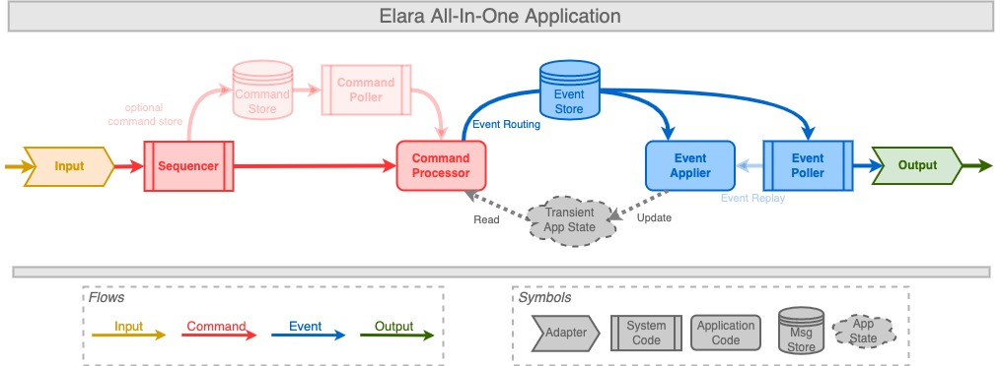

[](https://github.com/tools4j/elara/actions?query=workflow%3A%22Continuous+Integration%22)
[](https://search.maven.org/search?q=a:elara-*)
[](http://www.javadoc.io/doc/org.tools4j/elara-core)
## elara
The tools4j elara project provides an efficient, zero garbage framework to implement event sourcing applications.  

The event store is pluggable; a default implementation is available for [chronicle queue](https://github.com/OpenHFT/Chronicle-Queue).
  
Elara uses [direct buffers](https://www.javadoc.io/static/org.agrona/agrona/1.7.1/index.html?org/agrona/DirectBuffer.html) as defined by the [agrona](https://github.com/real-logic/agrona) library.  For this reason elara applications are perfectly suited to integrate with [SBE](https://github.com/real-logic/simple-binary-encoding) and [aeron](https://github.com/real-logic/aeron) UDP/IPC messaging.

The elara library is used productively in applications in the financial industry.  However elara is also under active development and some new plugins and features may be considered experimental especially if they are not released yet.

### Overview

#### Introduction
There are excellent introductions to event sourcing out there.  Some of our favorite links are
* https://microservices.io/patterns/data/event-sourcing.html
* https://www.youtube.com/watch?v=fhZwzm-d9ys
* https://martinfowler.com/eaaDev/EventSourcing.html

#### Elara Event Sourcing
A typical elara event sourcing application performs the following main functions:
* Creating commands from upstream processes or input sources 
* Processing commands by routing events; provides access to the application state but modification operations are prohibited 
* Applying events to update the application state
* Publishing output to downstream processes from selected events

These main functional modules can be processed in a single process or in separate applications.  Elara supports
different _application types_ for different subsets of those main modules (some app types include additional function 
modules as well).

In the simplest case, a single application performs all 4 main functions from above.

#### Elara All-In-One Application

Application type that performs all main functional modules in a single threaded application.



### Terminology 
* **Command:** essentially an input message but enriched with a timestamp and a source ID and a sequence number; can be a state modifying command instruction or a query
* **Event:** result of processing a command; instruction how to modify state or what output to generate
* **Command Processor:** handles commands and has read-only access to application state; routes events
* **Event Applier:** triggered by events (routed or replayed); modifies the application state according to the event instruction
* **Command Store:** (optional) persists all incoming commands before they are passed to the _Command Processor_; useful to replay commands (as opposed to reconstructing the application state from replayed events) 
* **Event Store:** persisted store with all routed events stored sequentially in appending order
* **Application State:** transient in-memory state of the application;  can be constructed from events via _Event Applier_
* **Input:** a source of input messages for instance from an upstream process
* **Output:** output message created from an event, usually published to a downstream process or system

### Plugins
Plugins are optional features that can be configured when defining the application context.  Third party plugins can be
provided by implementing the plugin API.  

Plugins can define their own state and applications can optionally access plugin state when defining the plugins in the
elara context.  By convention plugins define commands and events with negative types which marks them as 'admin' types 
so that they can be easily distinguished from non-negative application types.

Elara provides the following default plugins:

* **boot:** a plugin that issues commands and events indicating that an elara application has been started and initialised
* **timer:** a plugin that allows routing of events to start and stop simple and periodic timers;  the plugin injects
             commands to fire or expire timers which are then removed from the timer state through an event 
             (see samples section for examples) 
* **metrics:** plugin to capture time and frequency metrics of the running application;  a running application 
               efficiently captures metrics in a message store file that can be inspected with the store printer tool  
* **repair:** a plugin that attempts to repair a corrupted event store on startup if the last event in the store is not 
              committed, for instance after a crash when processing of the last command did not finish properly;  the
              repair operation appends a rollback event for the last command in this case 
* **replication:** *[experimental]* plugin to replicate events from a leader elara instance to follower instances that 
                   are applying events but do not process commands;  follower instances have identical state as the 
                   leader (after applying all events and assuming deterministic application logic);  together with the
                   provided leader change commands applications can use this plugin to support rolling upgrades or 
                   implement manual or automatic fail-over strategies

### Samples

#### Banking application
A simple banking app that supports the following commands:
* Creation of a bank account
* Money deposit, withdrawal and transfer

Sample code and test to run:
* [bank sample](https://github.com/tools4j/elara/tree/master/elara-samples/src/main/java/org/tools4j/elara/samples/bank)
* [bank test](https://github.com/tools4j/elara/blob/master/elara-samples/src/test/java/org/tools4j/elara/samples/bank/BankApplicationTest.java)

#### Timers
Timers are tricky with event sourcing.  Elara provides timers through the [timer plugin](https://github.com/tools4j/elara/tree/master/elara-core/src/main/java/org/tools4j/elara/plugin/timer) with support for once-off and periodic timers.  The timer sample app demonstrates both timer types in action:
* [timer app](https://github.com/tools4j/elara/tree/master/elara-samples/src/main/java/org/tools4j/elara/samples/timer)
* [timer app test](https://github.com/tools4j/elara/blob/master/elara-samples/src/test/java/org/tools4j/elara/samples/timer/TimerApplicationTest.java)

### Maven/Gradle

#### Maven
```xml
<dependency>
        <groupId>org.tools4j</groupId>
        <artifactId>elara-core</artifactId>
        <version>1.7</version>
</dependency>
```

#### Gradle
```
api "org.tools4j:elara-core:1.7'
```

### Download
You can download binaries, sources and javadoc from maven central:
* [elara download](https://search.maven.org/search?q=a:elara-*)

### Credits
* For best performance elara needs to be allocation free.  We achieve this by profiling elara with [JProfiler](https://www.ej-technologies.com/products/jprofiler/overview.html)
